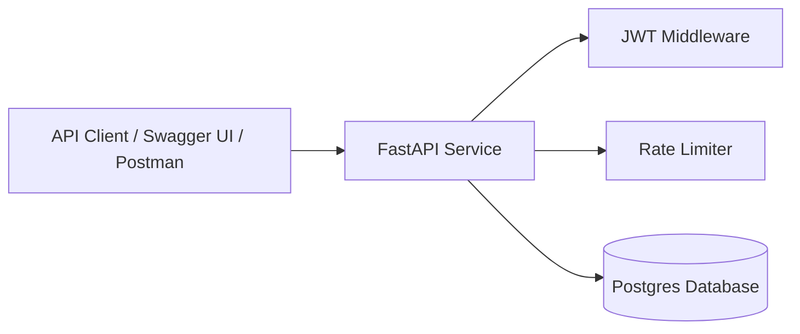

# TaskBeacon

TaskBeacon is a cloud-deployed, production-minded task management API built with FastAPI, Postgres, and Docker. The project focuses on backend system design, authentication, and service reliability rather than frontend UI.

---

## Features (MVP Scope)
- User registration and JWT-based authentication
- Create, list, update, and delete personal tasks
- Per-user task isolation
- Health check endpoint for service monitoring
- Dockerized local and cloud deployment workflow

---

## High-Level Architecture

For more detail, see:
- [Architecture](docs/architecture.md)
- [MVP Spec](docs/spec.md)
- [Design Decisions](docs/decisions.md)
- [API Overview](docs/api.md)

---

## Local Development
Local setup instructions will be added in Milestone 1.

---

## Status
This project is under active development and is being built incrementally with defined milestones and documented design decisions.