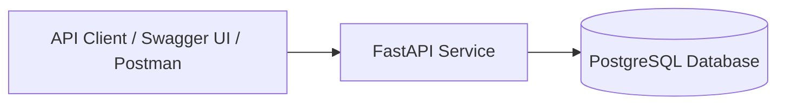

# TaskBeacon

TaskBeacon is a backend task management API built with FastAPI.
The project is being developed incrementally toward a production-ready system
with authentication, persistent storage, and cloud deployment.

---

## Features (MVP Scope)
- User registration and JWT-based authentication
- Create, list, update, and delete personal tasks
- Per-user task isolation
- Health check endpoint for service monitoring
- Dockerized local and cloud deployment workflow

---

## High-Level Architecture


> Note: TaskBeacon currently uses PostgreSQL for persistent storage.
Future milestones will introduce rate limiting and production deployment.

> See `docs/architecture.md` for the planned production architecture.


For more detail, see:
- [Architecture](docs/architecture.md)
- [MVP Spec](docs/spec.md)
- [Design Decisions](docs/decisions.md)
- [API Overview](docs/api.md)

---

## Local Development
### Local run instructions for TaskBeacon (v0.1.0):
#### Prerequisites
The following must be installed before running TaskBeacon locally:

- Python 3.11+
- Docker Desktop (with Docker Compose enabled)

Verify Docker is installed:

```bash
docker --version
docker compose version
```

#### Create a Python virtual environment and install dependencies
1. Open a terminal in the project root directory
2. In your terminal, enter `python -m venv .venv`. This will create the python virtual environment in folder `.venv/`
3. Activate the virtual environment with:

**Powershell**
```powershell
.venv/Scripts/Activate.ps1
```
**Linux / Mac**
```bash
source .venv/bin/activate
```
Your terminal should now look something like this:
```terminal
(.venv) PS C:\PathToTaskBeacon\TaskBeacon>
```
4. With the python virtual environment activated, install the project dependencies outlined in requirements.txt with `pip install -r requirements.txt`

#### Database Setup (PostgreSQL + Alembic)
TaskBeacon uses PostgreSQL for persistent storage and Alembic for schema migrations. The database runs locally via Docker.

**1. Start the database (PostgreSQL) container**

From project root:
```bash
docker compose up -d
```
  This starts the database using the configuration in docker-compose.yml.

**2. Configure environment variables (optional)**

Environment variables are located in the .env file. Make sure that the configuration in docker-compose.yml matches environment variables.

**3. Apply database migrations**

After starting the database, run:
```bash
alembic upgrade head
```
This will automatically create and setup the full TaskBeacon database schema. If successful, you should see:

```bash
Running upgrade -> <revision>, create users and tasks
```

**4. Verify database is working**

Start the API by following the "Running TaskBeacon" instructions below. Then use the `db-ping` endpoint to verify the database is working. If successful, you should see:
```json
{"status": "ok"}
```

**5. Resetting the databse**

Resetting the database will delete all saved data. To do so, from project root:
```bash
docker compose down -v
docker compose up -d
alembic upgrade head
```


#### Running TaskBeacon
1. Ensure that the virtual environment is activated
2. Start the server with `uvicorn app.main:app --reload`. You should see something like this:
```terminal
(.venv) PS C:\PathToTaskBeacon\TaskBeacon> uvicorn app.main:app --reload
INFO:     Uvicorn running on http://127.0.0.1:8000 (Press CTRL+C to quit)
INFO:     Application startup complete.
```
3. Open a web browser and navigate to `http://127.0.0.1:8000/docs`
4. Use Swagger UI to test the available API endpoints and manage tasks

---

## Authentication (Swagger UI)

TaskBeacon uses JWT Bearer authentication. Many endpoints will require authentication.

### 1) Register a user
Call `POST /auth/register` with:
```json
{
  "email": "you@example.com",
  "password": "your-password"
}
```
### 2) Login to get a token

Call POST /auth/login with:
```json
{
  "email": "you@example.com",
  "password": "your-password"
}
```
The response includes an access_token.

### 3) Authorize in Swagger UI

1. Open Swagger UI: http://127.0.0.1:8000/docs
2. Click Authorize
3. Paste your token in the `Value:` field
```txt
Value:
<access_token>
```
4. Click **Authorize**

### 4) Call protected endpoints

Once authorized, you can call protected task endpoints like:
- GET /tasks
- POST /tasks
- PATCH /tasks/{task_id}
- DELETE /tasks/{task_id}

If you call any /tasks endpoint without authorizing, the API returns 401 Unauthorized.

---

## Status
This project is under active development and is being built incrementally with defined milestones and documented design decisions.