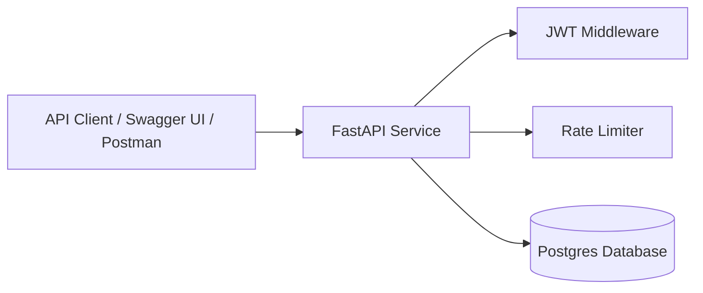
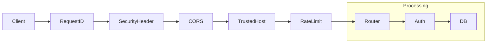

# TaskBeacon

TaskBeacon is a backend task management API built with FastAPI with authentication, persistent storage, and cloud deployment.

---

## Features
- User registration and JWT-based authentication
- Create, list, update, and delete personal tasks
- Per-user task isolation
- Health check endpoints for service and dependency monitoring
- Dockerized local and cloud deployment workflow

---

## High-Level Architecture


```mermaid
flowchart LR
    Client[API Client / Swagger UI / Postman] --> API[FastAPI Service]
    API --> Auth[JWT Middleware]
    API --> RateLimit[Rate Limiter]
    API --> DB[(Postgres Database)]
```
> Note: TaskBeacon currently uses PostgreSQL for persistent storage.

> See `docs/architecture.md` for the production architecture.

## Request Lifecycle Diagram


```mermaid
flowchart LR

    Client --> RequestID --> SecurityHeader --> CORS --> TrustedHost --> RateLimit

    RateLimit --> Router

    subgraph Processing
        direction TB
        Router --> Auth --> DB
    end
```

For more detail, see:
- [Architecture](docs/architecture.md)
- [Spec](docs/spec.md)
- [API Overview](docs/api.md)

---

## Local Development
### Local run instructions for TaskBeacon:
#### Prerequisites
The following must be installed before running TaskBeacon locally:

- Python 3.11+
- Docker Desktop (with Docker Compose enabled)

Verify Docker is installed:

```bash
docker --version
docker compose version
```

---

#### Create a Python virtual environment and install dependencies
1. Open a terminal in the project root directory
2. In your terminal, enter `python -m venv .venv`. This will create the python virtual environment in folder `.venv/`
3. Activate the virtual environment with:

**Powershell**
```powershell
.venv/Scripts/Activate.ps1
```
**Linux / Mac**
```bash
source .venv/bin/activate
```
Your terminal should now look something like this:
```terminal
(.venv) PS C:\PathToTaskBeacon\TaskBeacon>
```
4. With the python virtual environment activated, install the project dependencies outlined in requirements.txt with `pip install -r requirements.txt`

---

#### Database Setup (PostgreSQL + Alembic)
TaskBeacon uses PostgreSQL for persistent storage and Alembic for schema migrations. The database runs locally via Docker.

**1. Start the database (PostgreSQL) container**

From project root:
```bash
docker compose up -d
```
  This starts the database using the configuration in docker-compose.yml.

**2. Configure environment variables (optional)**

Environment variables are located in the .env file. Make sure that the configuration in docker-compose.yml matches environment variables.

**3. Apply database migrations**

After starting the database, run:
```bash
alembic upgrade head
```
This will automatically create and setup the full TaskBeacon database schema. If successful, you should see:

```bash
Running upgrade -> <revision>, create users and tasks
```

**4. Verify database is working**

Start the API by following the "Running TaskBeacon" instructions below. Then use the `/api/health/ready` endpoint to verify the database is working. If successful, you should see:
```json
{"status": "ok"}
```

**5. Resetting the databse**

Resetting the database will delete all saved data. To do so, from project root:
```bash
docker compose down -v
docker compose up -d
alembic upgrade head
```

---

#### Running TaskBeacon (dev mode)
By default TaskBeacon will run in dev mode. For production mode, see "Running TaskBeacon (local prod mode)".
1. Ensure that the virtual environment is activated
2. Start the server with `uvicorn app.main:app --reload`. You should see something like this:
```terminal
(.venv) PS C:\PathToTaskBeacon\TaskBeacon> uvicorn app.main:app --reload
INFO:     Uvicorn running on http://127.0.0.1:8000 (Press CTRL+C to quit)
INFO:     Application startup complete.
```
3. Open a web browser and navigate to `http://127.0.0.1:8000/docs`
4. Use Swagger UI to test the available API endpoints and manage tasks

---

#### Running TaskBeacon (local prod mode)
In production (PROD) mode, the app:
- disables Swagger/OpenAPI docs
- enforces TrustedHost middleware
- enables stricter security behavior

**1. Configure .env**

- Copy or rename the example file and fill in real values:
```bash
cp .env.example .env
```
.env must define at least:
- DATABASE_URL
- JWT_SECRET
- ENV=PROD
- ALLOWED_HOSTS

**Configuration**

TaskBeacon is configured via environment variables loaded from `.env` in development.

| Variable | Example | Meaning |
| -------- | -------- | -------- |
| `ENV` | `DEV`/`PROD` | Controls dev vs prod behavior (docs, TrustedHost enforcement, etc.) |
| `LOG_LEVEL` | `INFO` | Logging verbosity (`DEBUG`, `INFO`, `WARNING`, `ERROR`) |
| `DATABASE_URL` | `postgresql+psycopg://...` | Postgres connection string |
| `DB_STATEMENT_TIMEOUT_MS` | `5000` | Max time a SQL statement may run before Postgres cancels it |
| `DB_CONNECT_TIMEOUT_S` | `2` | Max time allowed to establish a DB connection when DB is down/unreachable |
| `DB_POOL_TIMEOUT_S` | `2` | Max time to wait for a pooled DB connection checkout |
| `JWT_SECRET` | `REPLACE_WITH_RANDOM_SECRET` | Secret used to sign JWTs (must be strong in prod) |
| `JWT_ALGORITHM` | `HS256` | JWT signing algorithm |
| `ACCESS_TOKEN_EXPIRE_MINUTES` | `60` | JWT access token expiration |
| `CORS_ORIGINS` | `["http://localhost:3000"]` | Allowed browser origins that may read API responses |
| `ALLOWED_HOSTS` | `["localhost","127.0.0.1"]` | Allowed Host headers (TrustedHost). In prod, set to your real domain(s) |
| `RATE_LIMIT_ENABLED` | `True` | Enable or disable rate limiting |
| `RATE_LIMIT_DEFAULT` | `120/minute` | Global default rate limit (all endpoints) |
| `RATE_LIMIT_AUTH_LOGIN` | `10/minute` | Login endpoint rate limit |
| `RATE_LIMIT_AUTH_REGISTER` | `5/minute` | Register endpoint rate limit |
| `RATE_LIMIT_AUTH_ME` | `60/minute` | Me endpoint rate limit |


**Generating a strong JWT secret**

```bash
python3 -c "import secrets; print(secrets.token_urlsafe(48))"
```

Then copy the output into .env as `JWT_SECRET=key output`

**JWT secret rotation**

Safe rotation procedure:

1. Generate a new secret
2. Deploy the new secret by updating `JWT_SECRET` environment variable
3. Restart TaskBeacon
4. Expect that all clients must log in again as previously administered tokens will fail with 401

**2. Start Postgres database docker container**

- Follow the instructions for "Database Setup"

**3. Run TaskBeacon**

```bash
uvicorn app.main:app --host 127.0.0.1 --port 8000 --workers 2
```


## Authentication (Swagger UI)

TaskBeacon uses JWT Bearer authentication. Many endpoints will require authentication.

### 1) Register a user
Call `POST /auth/register` with:
```json
{
  "email": "you@example.com",
  "password": "your-password"
}
```
### 2) Login to get a token

Call POST /auth/login with:
```json
{
  "email": "you@example.com",
  "password": "your-password"
}
```
The response includes an access_token.

### 3) Authorize in Swagger UI

1. Open Swagger UI: http://127.0.0.1:8000/docs
2. Click Authorize
3. Paste your token in the `Value:` field
```txt
Value:
<access_token>
```
4. Click **Authorize**

### 4) Call protected endpoints

Once authorized, you can call protected task endpoints like:
- GET /tasks
- POST /tasks
- PATCH /tasks/{task_id}
- DELETE /tasks/{task_id}

If you call any /tasks endpoint without authorizing, the API returns 401 Unauthorized.

---

## Rate Limiting

TaskBeacon includes built-in rate limiting to protect the service from abuse, accidental overload, and brute-force attacks.

Rate limiting is enforced globally via middleware and can also be applied per-endpoint (e.g. authentication routes).

### Behavior

When a client exceeds the allowed request rate, the API responds with:

**HTTP 429 — Too Many Requests**

Example response:

```json
{
  "error": "rate_limited",
  "message": "Too many requests",
  "details": {
    "retry_after": 42
  },
  "request_id": "..."
}
```

#### How Limits are Applied
- Authenticated requests (via JWT) are limited per user
- Unauthenticated requests are limited per IP address
- Rate limits are enforced before the endpoint executes

#### Default Rate Limits (Configurable via env variables)

| Scope | Default |
| ---- | ---- |
| Global default (all endpoints) | 120 requests / minute |
| Login endpoint | 10 requests / minute |
| Register endpoint | 5 requests / minute |

---

## Status
This project is considered complete and is in a deployable state. Future improvements may be considered at a later date.
