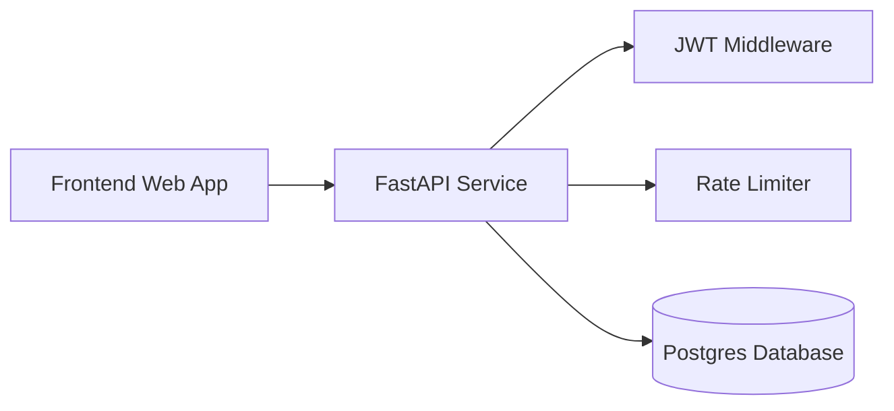
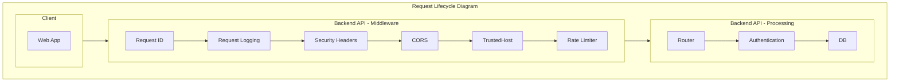

# TaskBeacon

TaskBeacon is a full-stack task management API built with a FastAPI backend, a PostgreSQL database, and a React SPA frontend. The web app and API backend are deployed to AWS cloud infrastructure managed by Terraform IaC. TaskBeacon is currently live at https://www.taskbeacon.ca

---

## Features
- User registration and JWT-based authentication
- Create, list, update, and delete personal tasks
- Per-user task isolation
- Health check endpoints for service and dependency monitoring
- Containerized backend
- Cloud deployment

---

## High-Level Architecture


```mermaid
flowchart LR
    Client[Frontend Web App] --> API[FastAPI Service]
    API --> Auth[JWT Middleware]
    API --> RateLimit[Rate Limiter]
    API --> DB[(Postgres Database)]
```
> Note: TaskBeacon currently uses PostgreSQL (hosted by Supabase) for persistent storage.

> See `docs/architecture.md` for the production architecture.

## Request Lifecycle Diagram


```mermaid
flowchart LR
  subgraph reqlifecycle[Request Lifecycle Diagram]
    direction LR
    subgraph Client
      client[Web App]
    end
      
    subgraph Middleware[Backend API - Middleware]
      direction LR
      id[Request ID] --> log[Request Logging]
      log[Request Logging] --> security[Security Headers]
      security[Security Headers] --> cors[CORS]
      cors[CORS] --> trustedhost[TrustedHost]
      trustedhost[TrustedHost] --> ratelimit[Rate Limiter]
      
    end
    subgraph Processing[Backend API - Processing]
      direction LR
      router[Router] --> auth[Authentication]
      auth[Authentication] --> db[DB]
    end
    Middleware --> Processing
    Client --> Middleware
  end
    
```

For more detail, see:
- [Architecture](docs/architecture.md)
- [Spec](docs/spec.md)
- [API Overview](docs/api.md)

---

## Rate Limiting

TaskBeacon includes built-in rate limiting to protect the service from abuse, accidental overload, and brute-force attacks.

Rate limiting is enforced globally via middleware and can also be applied per-endpoint (e.g. authentication routes).

### Behavior

When a client exceeds the allowed request rate, the API responds with:

**HTTP 429 — Too Many Requests**

Example response:

```json
{
  "error": "rate_limited",
  "message": "Too many requests",
  "details": {
    "retry_after": 42
  },
  "request_id": "..."
}
```

#### How Limits are Applied
- Authenticated requests (via JWT) are limited per user
- Unauthenticated requests are limited per IP address
- Rate limits are enforced before the endpoint executes

#### Default Rate Limits (Configurable via env variables)

| Scope | Default |
| ---- | ---- |
| Global default (all endpoints) | 120 requests / minute |
| Login endpoint | 10 requests / minute |
| Register endpoint | 5 requests / minute |

---

## Status
This project is considered complete and is in a deployable state. Future improvements may be considered at a later date.
