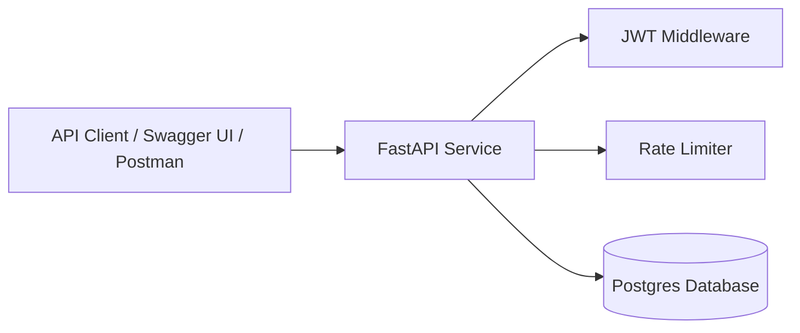

# TaskBeacon — Architecture (v0)

## Overview
TaskBeacon is a cloud-deployed, production-minded backend service that exposes a REST API for managing personal tasks. The system is designed to demonstrate authentication, persistence, service reliability, and basic operational practices in a simple, focused architecture.

---

## High-Level System Diagram

## Components

### Client
Represents any HTTP client interacting with the service, such as:
- Swagger UI (/docs)
- Postman / Insomnia
- curl
- A future frontend or integration

#### Responsibilities:
- Send HTTP requests
- Provide JWT tokens in the Authorization header for protected endpoints
- Parse JSON responses

### FastAPI Service

The core backend application responsible for:
- Routing requests to handlers
- Validating input data
- Executing business logic
- Formatting JSON responses
- Returning appropriate HTTP status codes

### JWT Middleware
- A request-level component that:
- Extracts the Authorization header
- Verifies the JWT signature
- Decodes the user identity from the token
- Rejects unauthorized requests with 401 Unauthorized

### Rate Limiter
Applies request limits to protect the service from abuse and accidental overload.

#### Planned scope:
- Per-IP limits for unauthenticated endpoints
- Per-user limits for authenticated endpoints
- Stricter limits on authentication routes

### Database (Postgres)
Persistent storage for application data.
#### Stores:
- Users
- Tasks
#### Responsibilities:
- Enforce data integrity
- Support indexed lookups for task queries
- Maintain referential relationships between users and tasks

### Request Lifecycle (Example)
1. Client sends HTTP request to the API
2. Rate limiter checks whether the request is allowed
3. JWT middleware validates the token (if the endpoint is protected)
4. FastAPI route handler validates request data
5. Business logic executes
6. Database is queried or updated
7. API returns a JSON response with an appropriate HTTP status code

### Deployment Architecture (Planned)
- Application runs in a Docker container
- Postgres runs as a managed service or a separate container
- Service is deployed to Render
- Configuration is provided via environment variables

### Design Goals
- Keep the architecture simple and understandable
- Favor clarity over premature optimization
- Maintain clear separation between API, authentication, and persistence layers
- Ensure the system can be deployed and observed in a production-like environment

### Future Considerations (Out of Scope for MVP)
- Background workers (e.g., task reminders)
- Caching layer (e.g., Redis)
- Metrics and dashboards (Prometheus / Grafana)
- Horizontal scaling and load balancing

