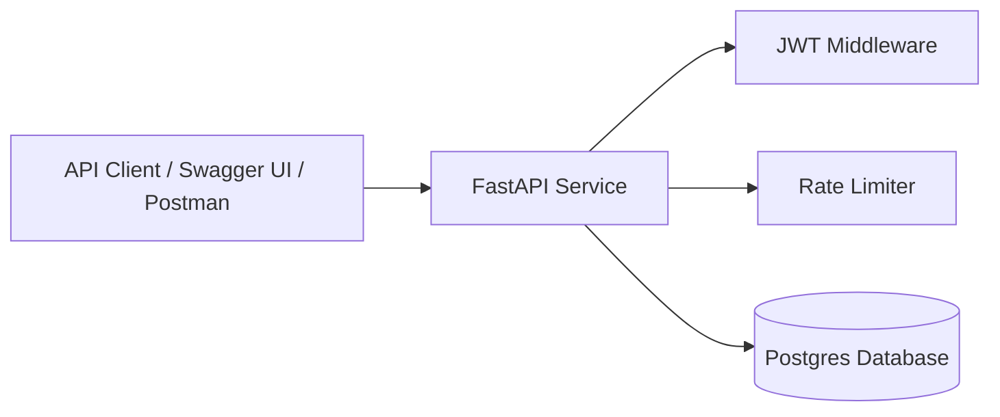
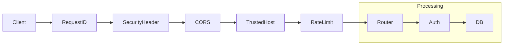

# TaskBeacon — Architecture (v0)

## Overview
TaskBeacon is a cloud-deployed, production-minded backend service that exposes a REST API for managing personal tasks. The system is designed to demonstrate authentication, persistence, service reliability, and basic operational practices in a simple, focused architecture.

---

## High-Level System Diagram

```mermaid
flowchart LR
    Client[API Client / Swagger UI / Postman] --> API[FastAPI Service]
    API --> Auth[JWT Middleware]
    API --> RateLimit[Rate Limiter]
    API --> DB[(Postgres Database)]
```

## Request Lifecycle Diagram

```mermaid
flowchart LR

    Client --> RequestID --> SecurityHeader --> CORS --> TrustedHost --> RateLimit

    RateLimit --> Router

    subgraph Processing
        direction TB
        Router --> Auth --> DB
    end
```

### Request Lifecycle (Example)
1. Client sends HTTP request
2. Request-level middleware executes (logging, request ID, security headers)
3. Rate limiting middleware checks request
4. Router matches request to endpoint
5. Route-level dependencies execute (e.g., JWT authentication)
6. Request data is validated
7. Business logic executes
8. Database interaction occurs
9. Response is returned

## Components

### Client
Represents any HTTP client interacting with the service, such as:
- TaskBeacon web frontend
- Swagger UI (/docs, disabled in production)
- Postman / Insomnia
- curl

#### Responsibilities:
- Send HTTP requests
- Provide JWT tokens in the Authorization header for protected endpoints
- Parse JSON responses

### FastAPI Service

The core backend application responsible for:
- Routing requests to handlers
- Validating input data
- Executing business logic
- Formatting JSON responses
- Returning appropriate HTTP status codes

### JWT Middleware
- A request-level component that:
- Extracts the Authorization header
- Verifies the JWT signature
- Decodes the user identity from the token
- Rejects unauthorized requests with 401 Unauthorized

### Rate Limiter
Applies request limits to protect the service from abuse and accidental overload.

#### Scope:
- Per-IP limits for unauthenticated endpoints
- Per-user limits for authenticated endpoints
- Stricter limits on authentication routes

### Database (PostgreSQL)
Persistent storage for application data.
#### Stores:
- Users
- Tasks
#### Responsibilities:
- Enforce data integrity
- Support indexed lookups for task queries
- Maintain referential relationships between users and tasks

### Deployment Architecture
- Application runs in a Docker container via AWS AppRunner
- PostgreSQL runs as a managed service with AWS RDS
- Service is deployed to AWS (AppRunner and RDS)
- Configuration is provided via environment variables

### Design Goals
- Keep the architecture simple and understandable
- Favor clarity over premature optimization
- Maintain clear separation between API, authentication, and persistence layers
- Ensure the system can be deployed and observed in a production-like environment

### Future Considerations (Out of Scope for MVP)
- Background workers (e.g., task reminders)
- Caching layer (e.g., Redis)
- Metrics and dashboards (Prometheus / Grafana)
- Horizontal scaling and load balancing

